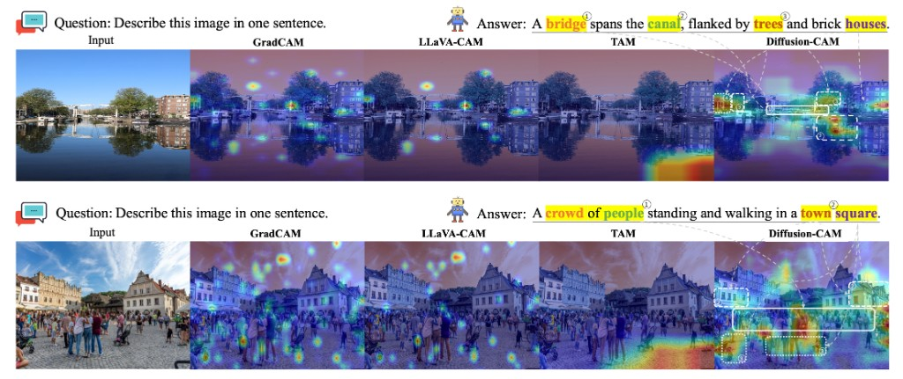
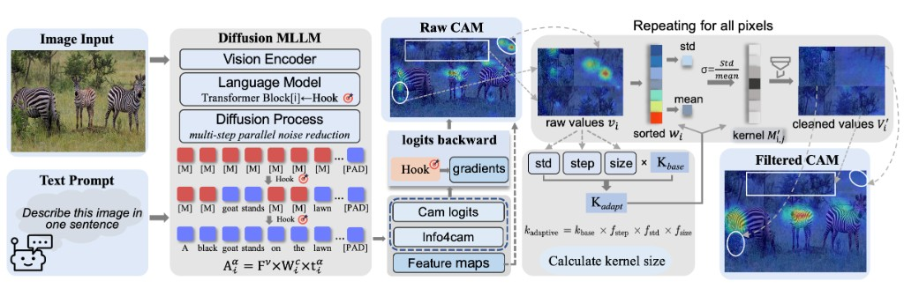
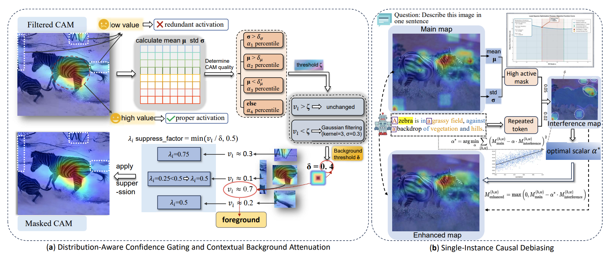

<div align="center">

# Diffusion-CAM: Faithful Visual Explanations for dMLLMs

<p>
  <b>Haomin Zuo</b><sup>2</sup>&nbsp;&nbsp;
  Yidi Li<sup>3</sup>&nbsp;&nbsp;
  Luoxiao Yang<sup>4</sup>&nbsp;&nbsp;
  Xiaofeng Zhang<sup>1&dagger;</sup>
</p>

<p>
  <sup>1</sup>Shanghai Jiao Tong University&nbsp;&nbsp;
  <sup>2</sup>Sun Yat-sen University<br>
  <sup>3</sup>Northwestern University&nbsp;&nbsp;
  <sup>4</sup>Technion - Israel Institute of Technology
</p>

<p>
  <a href="https://github.com/ZzzzzZhhmm/Diffusion-CAM">
    
  </a>
  <a href="https://arxiv.org/abs/2604.11005">
    
  </a>
  <a href="https://github.com/ZzzzzZhhmm/Diffusion-CAM/blob/main/LICENSE">
    
  </a>
  
  
  <a href="https://github.com/ZzzzzZhhmm/Diffusion-CAM/stargazers">
    
  </a>
</p>

<p>
  <a href="#-overview">Overview</a> &nbsp;|&nbsp;
  <a href="#-method">Method</a> &nbsp;|&nbsp;
  <a href="#-results">Results</a> &nbsp;|&nbsp;
  <a href="#-installation">Installation</a> &nbsp;|&nbsp;
  <a href="#-quick-start">Quick Start</a> &nbsp;|&nbsp;
  <a href="#-citation">Citation</a>
</p>

</div>

> ⭐ **TL;DR** — Diffusion-CAM is the **first interpretability method tailored for diffusion-based multimodal large language models (dMLLMs)**. It adapts gradient-based CAM to the masked-denoising generation paradigm and adds four refinement modules to produce sharp, faithful, background-suppressed activation maps.

<div align="center">
  
  <br>
</div>

---

## 🔍 Overview

Most existing explanation methods for multimodal large language models are designed for **autoregressive** generation, where each token attends to its predecessors and provides a clear gradient path back to the visual features.

Diffusion MLLMs instead generate responses through **iterative masked denoising** under fixed multimodal conditioning. Tokens are produced in parallel, yielding smooth, distributed activations rather than local sequential dependencies. As a result, applying conventional CAM methods produces **diffuse, non-specific heatmaps**.

**Diffusion-CAM** is built for this setting. It extracts attribution from **structurally valid intermediate multimodal states** along the denoising trajectory, where image-grounded spatial information is still preserved, and traces gradients from the final response back to those image-grounded hidden features.

The full framework consists of a base extractor plus four complementary refinement modules:

| Module | Name | Purpose |
| :----: | :--- | :------ |
| **AKD**  | Adaptive Kernel Denoising           | Rank-weighted Gaussian filtering with a dynamic kernel to remove high-frequency architectural artifacts. |
| **DACG** | Distribution-Aware Confidence Gating | Statistics-driven, selective denoising that separates high- and low-confidence regions. |
| **CBA**  | Contextual Background Attenuation   | Multi-scale statistical thresholding with soft attenuation to suppress background residuals. |
| **SICD** | Single-Instance Causal Debiasing    | Removes interference from repeated function words and statistical outliers on a single image. |

### ✨ Highlights

- First interpretability framework purpose-built for **dMLLMs** (LaViDa / LLaDA-V / MMaDA / Dream-VL style backbones).
- **Model-aware feasibility check**: the attribution step is not hard-coded, and is selected only when the hidden state still contains the full image-token span.
- Four **plug-and-play, CPU-only** refinement modules that add negligible overhead (~0.7% of the attribution pass).
- New **state-of-the-art** localization accuracy and background suppression on COCO Caption and GranDf.

---

## 🧩 Method

<div align="center">
  
  <br>
  <em>Raw CAM generation via hooked hidden states/gradients along the denoising process (left), and Adaptive Kernel Denoising with a dynamic, statistics-calibrated kernel (right).</em>
</div>

<br>

<div align="center">
  
  <br>
  <em>(a) Distribution-Aware Confidence Gating and Contextual Background Attenuation. (b) Single-Instance Causal Debiasing.</em>
</div>

The pipeline is: multimodal generation &rarr; hidden-state hook registration &rarr; gradient backpropagation from the final response &rarr; dynamic image-span slicing &rarr; base Diffusion-CAM &rarr; optional refinement with AKD / DACG / CBA / SICD.

---

## 📊 Results

Comparison with state-of-the-art methods on **COCO Caption** and **GranDf**. F3-Score is the harmonic mean of the three core metrics.

<div align="center">

| Method | \| | COCO Obj-IoU (%) | COCO Contrast | COCO Concen. | COCO F3 | \| | GranDf Obj-IoU (%) | GranDf Contrast | GranDf Concen. | GranDf F3 |
| :--- | :-: | :-: | :-: | :-: | :-: | :-: | :-: | :-: | :-: | :-: |
| LLaVA-CAM | \| | 20.02 | 2.18&times; | 41.22 | 18.08 | \| | 18.16 | 1.41&times; | 70.80 | 14.22 |
| Grad-CAM  | \| | 19.93 | 2.04&times; | 41.91 | 17.43 | \| | 17.82 | 1.48&times; | 75.42 | 14.67 |
| TAM       | \| | 15.21 | 2.51&times; | 40.10 | 17.61 | \| | 20.39 | 1.36&times; | 67.31 | 14.23 |
| **Diffusion-CAM (Ours)** | \| | **30.10** | **2.58&times;** | **51.41** | **23.04** | \| | **28.41** | **2.02&times;** | **86.14** | **20.53** |

</div>

**Ablation on COCO Caption** — each module contributes complementary gains, and enabling all four lifts F3-Score by ~4.9%.

<div align="center">

| Config. | Obj-IoU (%) | Contrast | Concen. | F3-Score |
| :--- | :-: | :-: | :-: | :-: |
| Baseline        | 20.12 | 2.19&times; | 41.42 | 18.16 |
| + Denoising (AKD)   | 25.85 | 2.28&times; | 44.01 | 20.16 |
| + Gating (DACG)     | 21.22 | 2.20&times; | 47.94 | 18.88 |
| + Attenuation (CBA) | 21.42 | 2.41&times; | 42.63 | 19.59 |
| + Debiasing (SICD)  | 24.11 | 2.29&times; | 44.31 | 19.82 |
| **Full**            | **30.10** | **2.58&times;** | **51.44** | **23.04** |

</div>

---

## ⚙️ Installation

We recommend **Python 3.10+** and a clean virtual environment.

**1. Create environment**

```bash
conda create -n diffusion-cam python=3.10 -y
conda activate diffusion-cam
```

**2. Install PyTorch (CUDA 11.8 example)**

```bash
pip install torch==2.7.1+cu118 torchvision==0.22.1+cu118 torchaudio==2.7.1+cu118 \
  --index-url https://download.pytorch.org/whl/cu118
```

If you use a different CUDA version or a CPU-only setup, install the matching PyTorch build first.

**3. Install project dependencies**

```bash
pip install -r requirements.txt
pip install -e .
```

**4. Install evaluation utilities**

```bash
cd eval
pip install -e .
cd ..
```

---

## 🚀 Quick Start

The repository supports two usage modes.

### 1. Method-only demo (no checkpoint required)

Runs the post-processing / refinement modules only, so you can inspect their behavior without a model.

```bash
python examples/toy_example.py
```

### 2. Full Diffusion-CAM pipeline

Runs generation, hidden-state hooking, gradient backpropagation, base Diffusion-CAM extraction, and optional refinement.

```bash
python predict.py \
  --selected_images path/to/ids.txt \
  --ablation_mode all_methods
```

Available `--ablation_mode` values: `baseline`, `gaussian_only`, `confidence_only`, `background_only`, `all_methods`.

Results are written to a `cam_results_<ablation_mode>/` directory.

> **Notes**
> - `--selected_images` requires `COCO_DATASET_PATH` to be set.
> - The full pipeline requires a compatible LaViDa / LLaDA-style backend.

### Full pipeline setup

Before running `predict.py`, set the backend paths:

```bash
export LAVIDA_MODEL_PATH=/path/to/your/model
export LAVIDA_VISION_TOWER=/path/to/your/vision_tower
```

For COCO-style evaluation, also set:

```bash
export COCO_DATASET_PATH=/path/to/coco
```

---

## 📁 Repository Structure

```text
.
├── assets/                 # Figures used in this README
├── baselines/              # Baseline methods (e.g. Grad-CAM)
├── eval/                   # Evaluation package / metric utilities
├── examples/               # Minimal runnable examples (toy_example.py)
├── method/diffusion_cam/   # Core Diffusion-CAM implementation
├── scripts/                # Launch scripts / DeepSpeed configs
├── vendor/                 # Vendored backend code (llava-style path)
├── predict.py              # Full pipeline entry
├── pyproject.toml          # Package / dependency configuration
├── requirements.txt
├── LICENSE
└── README.md
```

### Key components

- **`examples/toy_example.py`** — minimal demo for the post-processing modules only.
- **`predict.py`** — main entry for the full pipeline:
  1. Multimodal generation
  2. Hidden-state hook registration
  3. Gradient backpropagation
  4. Image-span feature slicing
  5. Base Diffusion-CAM construction
  6. Optional refinement with AKD / DACG / CBA / SICD
- **`method/diffusion_cam/`** — core implementation of Diffusion-CAM and its refinement modules.
- **`eval/`** — evaluation code for quantitative analysis.
- **`vendor/llava/`** — vendored backend code used by the full pipeline.

---

## 💡 Diffusion-Specific Note

A key difference from autoregressive CAM extraction is that the attribution step is **not hard-coded**.

Diffusion-CAM only extracts attribution from denoising steps whose hidden states still preserve the full image-token span required for spatial grounding. Under LaViDa's Prefix-DLM + KV-cached generation, for example, only the earliest conditioning step remains structurally valid; for other dMLLMs the same feasibility rule naturally extends to whichever steps stay valid. This model-aware check is central to making CAM work under masked denoising.

---

## 📝 Citation

If you find this work useful, please cite:

```bibtex
@inproceedings{zuo2026diffusioncam,
  title     = {Diffusion-CAM: Faithful Visual Explanations for dMLLMs},
  author    = {Zuo, Haomin and Li, Yidi and Yang, Luoxiao and Zhang, Xiaofeng},
  booktitle = {Proceedings of the 64th Annual Meeting of the Association for Computational Linguistics (ACL)},
  year      = {2026}
}
```

---

## 🙏 Acknowledgements

Our implementation builds on the LaViDa / LLaDA-V line of diffusion MLLMs and takes inspiration from prior CAM-based interpretability work, including Grad-CAM, LLaVA-CAM, and TAM.

## 📄 License

This repository is released under the license specified in [`LICENSE`](LICENSE).
